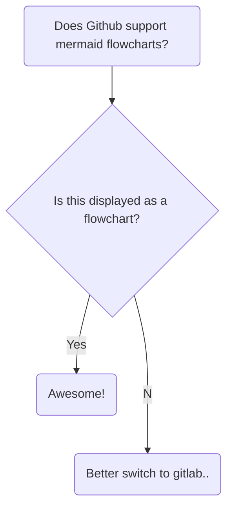

# does-github-support-mermaid

```mermaid

graph TD

start(Does Github support mermaid flowcharts?)

choice{Is this displayed as a flowchart?}

does(Awesome!)

doesnt(Better switch to gitlab..)

start-->choice

choice--Yes-->does

choice--No-->doesnt

```

This should look like [this](https://gitlab.com/mpnsk/does-gitlab-support-mermaid/blob/master/README.md)
